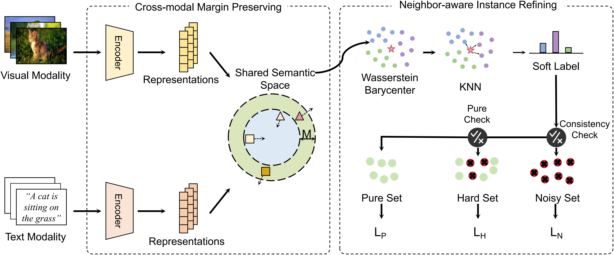

# NIRNL
The code for Neighbor-aware Instance Refining with Noisy Labels for Cross-Modal Retrieval (AAAI'26)

# Framework



# Citation
If you find this code useful for your research, please cite our paper:

```bib
@inproceedings{liu2026neighbor,
  title={Neighbor-aware Instance Refining with Noisy Labels for Cross-Modal Retrieval},
  author={Liu, Yizhi and Pu, Ruitao and Xu, Shilin and Chen, Yingke and Liu, Quan-Hui and Sun, Yuan},
  booktitle={Proceedings of the AAAI Conference on Artificial Intelligence},
  volume={40},
  number={28},
  pages={23908--23916},
  year={2026}
}